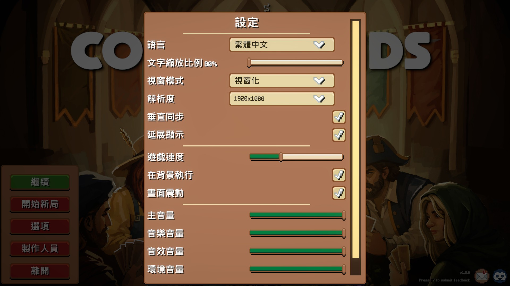
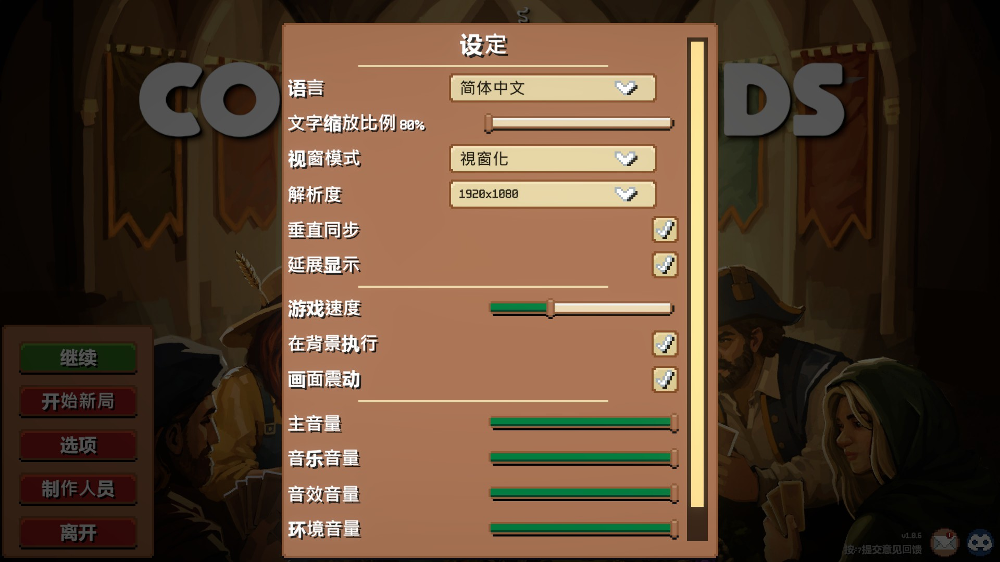

# Combolands 中文化模組

[繁體中文](README.md)｜[简体中文](README_zh_cn.md)

為 **Combolands** 提供繁體中文／簡體中文介面的社群中文化模組。

安裝後，你可以直接在遊戲的 **Settings** 選單切換：

- **English**
- **繁體中文**
- **简体中文**

模組也提供 **80%～140% 的文字縮放**，方便依螢幕尺寸與閱讀習慣調整介面文字。

> 目前版本：**v0.4.1**
> 適用平台：**Windows**  
> 需要先安裝：**BepInEx 5.x**

## 效果預覽

### 繁體中文

### 簡體中文

## 功能

- 繁體中文介面翻譯
- 繁體中文／簡體中文模式均使用中文化主選單 LOGO，English 保留原版 LOGO
- 簡體中文即時轉換
- 可隨時切回原版英文
- 不需要重新啟動遊戲即可切換語言
- 文字大小可調整為 80%～140%
- 語言與文字大小會自動記住
- 自動使用可用的中日韓系統字型，降低缺字／方框字問題
- 找不到翻譯的文字會保留原本英文，不會顯示空白內容

## 安裝

### 1. 先安裝 BepInEx

本模組需要 **BepInEx 5.x** 才能載入。

如果你的 Combolands 已經可以正常使用其他 BepInEx 模組，可以直接進行下一步。

如果尚未安裝 BepInEx，請先從官方 Release 頁面下載：

**[前往 BepInEx 官方下載頁面](https://github.com/BepInEx/BepInEx/releases)**

Combolands 是 Windows x64 遊戲，請選擇 **BepInEx 5.x 的 Windows x64 壓縮檔**，檔名會類似：

~~~text
BepInEx_win_x64_5.x.x.x.zip
~~~

目前官方 BepInEx 5 最新穩定版為 **5.4.23.5**，對應檔案為：

~~~text
BepInEx_win_x64_5.4.23.5.zip
~~~

下載後，將 BepInEx 壓縮檔內容直接解壓縮到放有 `Combolands.exe` 的遊戲根目錄，再啟動遊戲一次，讓 BepInEx 建立所需的資料夾與設定檔。

> 請使用 **BepInEx 5.x**。BepInEx 6 目前仍有預發行版本，而且 BepInEx 5 插件不能直接用 BepInEx 6 預發行版載入。  
> 本中文化模組的下載包**不包含 BepInEx**。

### 2. 下載中文化模組

前往 GitHub Releases：

**[下載最新版本](../../releases/latest)**

下載：

~~~text
Localization-vX.Y.Z.zip
~~~

例如 v0.4.1 對應：

~~~text
Localization-v0.4.1.zip
~~~

一般玩家只需要下載 ZIP，不需要下載原始碼。

### 3. 解壓縮到遊戲目錄

將 ZIP **直接解壓縮到 Combolands 遊戲根目錄**。

遊戲根目錄就是放有 `Combolands.exe` 的資料夾。

如果系統詢問是否合併 `BepInEx` 資料夾，請選擇合併。

安裝完成後應該可以看到：

~~~text
Combolands/
├── Combolands.exe
└── BepInEx/
    └── plugins/
        └── Localization/
            ├── Localization.dll
            └── zh-Hant.json
~~~

請特別確認 `Localization.dll` 與 `zh-Hant.json` 在**同一個資料夾**。

### 4. 啟動遊戲

正常啟動 Combolands。

第一次成功載入模組後，中文化設定會出現在遊戲原本的 **Settings** 選單中。

預設語言為 **繁體中文**。

## 使用方式

### 切換語言

進入：

**Settings → Language**

可以選擇：

- `English`
- `繁體中文`
- `简体中文`

選好後按遊戲原本的 **Apply** 按鈕。

語言會立即套用，不需要重新啟動遊戲。

如果按 **Cancel**，本次尚未套用的語言變更會取消。

### 調整文字大小

在 Settings 中可以看到：

**文字縮放比例**

可調整範圍：

~~~text
80% ～ 140%
~~~

每次調整 5%。

例如：

- 80%：較小文字，適合希望畫面更緊湊的玩家
- 100%：預設大小
- 120%～140%：較大文字，適合高解析度螢幕或希望提高可讀性的玩家

調整後同樣需要按 **Apply**。

### 設定會自動保存

成功按下 Apply 後，模組會記住：

- 使用的語言
- 文字縮放比例

下次啟動遊戲時會自動使用上次套用的設定。

## 更新模組

更新前建議先關閉遊戲。

1. 從 [Releases](../../releases) 下載新版 `Localization-vX.Y.Z.zip`
2. 再次解壓縮到 Combolands 遊戲根目錄
3. 選擇覆蓋舊的 `Localization.dll` 與 `zh-Hant.json`
4. 啟動遊戲

原本選擇的語言與文字大小通常會保留，不需要重新設定。

## 移除模組

先關閉遊戲，然後刪除：

~~~text
BepInEx/plugins/Localization/
~~~

這樣即可停止載入中文化模組。

如果也希望刪除模組保存的語言／文字大小設定，可以另外刪除：

~~~text
BepInEx/config/com.combolands.localization.cfg
~~~

移除中文化模組不需要修改遊戲存檔。

## 常見問題

### 安裝後遊戲仍然是英文

先檢查以下幾點：

1. BepInEx 是否已正確安裝並能正常載入模組
2. 檔案是否位於：

~~~text
BepInEx/plugins/Localization/Localization.dll
BepInEx/plugins/Localization/zh-Hant.json
~~~

3. 是否不小心多解壓縮了一層資料夾，例如：

~~~text
錯誤：
Combolands/Localization-v0.4.1/BepInEx/...

正確：
Combolands/BepInEx/...
~~~

4. 進入遊戲的 **Settings**，確認是否出現 **Language / 語言** 選項
5. 選擇中文後記得按 **Apply**

如果 Settings 完全沒有 Language 選項，通常表示模組沒有成功載入。

### 出現方框字、缺字或中文字型異常

模組會嘗試使用 Windows 上可用的中文字型。

繁體中文會優先使用例如：

- Microsoft JhengHei UI
- Microsoft JhengHei
- Noto Sans CJK TC / Noto Sans TC

簡體中文會優先使用例如：

- Microsoft YaHei UI
- Microsoft YaHei
- Noto Sans CJK SC / Noto Sans SC

一般 Windows 10／11 安裝通常已有可用字型。

如果使用精簡版 Windows、Wine／Proton 或自行移除過系統字型，可能需要另外安裝 CJK 字型。

### 為什麼有少量文字仍然是英文？

模組遇到沒有可用中文翻譯的項目時，會保留遊戲原本的英文，而不是顯示空白或錯誤文字。

另外，遊戲更新新增文字後，也可能暫時出現尚未翻譯的新內容。

### 簡體中文是獨立翻譯嗎？

目前中文翻譯以人工審校的**繁體中文內容**為主要來源。

選擇簡體中文時，模組會在 Windows 上即時將繁體中文轉換為簡體中文。因此簡體版本可能在個別遊戲術語上與專門人工撰寫的簡體翻譯有所差異。

### 更新遊戲後模組失效怎麼辦？

Combolands 更新後，如果遊戲內部介面或程式結構有改動，中文化模組可能需要同步更新。

請先查看 [Releases](../../releases) 是否已有新版。如果最新版本仍無法使用，可以回報問題並附上：

- Combolands 遊戲版本
- 中文化模組版本
- BepInEx 版本
- 發生問題的畫面／操作方式
- 如方便，附上 `BepInEx/LogOutput.log`

### 遊戲啟動後看不到 Settings 的 Apply／Cancel，或設定頁面顯示異常

本模組會在原本 Settings 畫面加入語言與文字縮放控制。

如果遇到版面超出畫面、無法捲動、按鈕無法操作等問題，請回報：

- 螢幕解析度
- Windows 顯示縮放比例
- 遊戲視窗／全螢幕設定
- 模組的文字縮放比例
- 問題畫面的截圖

這些資訊可以幫助定位不同螢幕環境下的 UI 問題。

## 相容性

目前模組版本：

~~~text
Localization v0.4.1
~~~

目前原始碼基線對應的 Combolands build：

~~~text
6000.0.66f2-f95343c07fe6-687f1dad7dbd
~~~

遊戲版本更新後不保證舊版模組仍能正常使用。

另外，成功編譯模組並不等於所有 Windows 遊戲環境都已完成實機驗證。如果遇到問題，請優先確認使用的是最新 Release。

## 問題回報

如果你發現：

- 翻譯錯誤
- 漏翻文字
- 簡繁用詞不自然
- 文字重疊或超出介面
- 缺字／方框字
- 語言切換異常
- Settings 無法正常操作

歡迎在 GitHub Issues 回報。

回報時如果能附上**原文、畫面截圖、出現位置與操作方式**，會更容易確認問題。

## 給開發者

此公開倉庫只包含中文化模組原始碼、翻譯檔與發佈流程；不包含或重新散布 Combolands、Unity、Assembly-CSharp、Sirenix／Odin 等遊戲或第三方 binaries。

一般玩家不需要自行編譯，請直接使用 [Releases](../../releases) 提供的 ZIP。

## 授權與免責聲明

此專案為社群製作的非官方中文化模組，與 Combolands 官方沒有隸屬關係。

本模組不包含 Combolands 遊戲本體，也不包含 BepInEx。